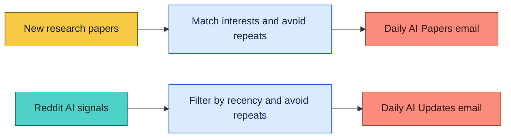

# Daily AI Research Automations for Claude Cowork

Open-source Claude Cowork automations for a daily AI research-paper digest and Reddit AI news briefing. AI moves fast: for the past four months, I have used these workflows to keep pace with new papers and the conversations shaping the field. Customize them for your interests, then have Claude deliver a useful daily brief to your inbox.

This repo includes:

- `prompts/Daily-ai-papers-digest.md`: emails three recent papers matched to your research interests.
- `prompts/Daily-ai-updates.md`: emails a concise AI digest from selected Reddit communities.

**Two daily loops:** discover, filter, avoid repeats, and deliver a focused email.

The prompt files and all prompt-specific instructions live in the [`prompts/`](prompts) folder.

## Use with Claude Code

1. Open the Claude Code app and select **Scheduled** in the upper-left navigation.
2. Click **New Task**, then copy the contents of a prompt from the [`prompts/`](prompts) folder into the task.
3. Replace every `{{TAG}}` with your own information and file paths.
4. Connect the required tools, authorize them, and schedule the task to run daily.

Both automations need a writable workspace for their history JSON files, which prevent duplicate recommendations. Initialize `paper_history.json` with `{ "papers": [] }` and `ai_digest_history.json` with `{}`.

To get `{{PAPER_HISTORY_PATH}}`, create `paper_history.json` in a persistent Cowork workspace and copy its full path into the tag. Ask Claude Cowork for the file's absolute path if it is not shown in the workspace UI.

## Required Tools

| Tool or MCP server | Papers | AI updates |
| --- | --- | --- |
| Gmail MCP server | Required | Required |
| Reddit MCP server | - | Required |

## Configuration Tags

| Tag | Purpose |
| --- | --- |
| `{{USER_NAME}}` | Name used in the papers email greeting. |
| `{{RESEARCH_PROFILE}}` | Your background and topics to prioritize. |
| `{{RECIPIENT_EMAIL}}` | Where to send the digests. |
| `{{PAPER_HISTORY_PATH}}` | Writable path to `paper_history.json`. |
| `{{AI_DIGEST_HISTORY_PATH}}` | Writable path to `ai_digest_history.json`. |

The paper focus areas in `prompts/Daily-ai-papers-digest.md` are based on my personal interests. Replace that list with the topics, research areas, and taste you want the digest to reflect. You can also customize the subreddit list in the AI updates prompt. Keep your filled-in values in your private Cowork automation, not this public repository.
